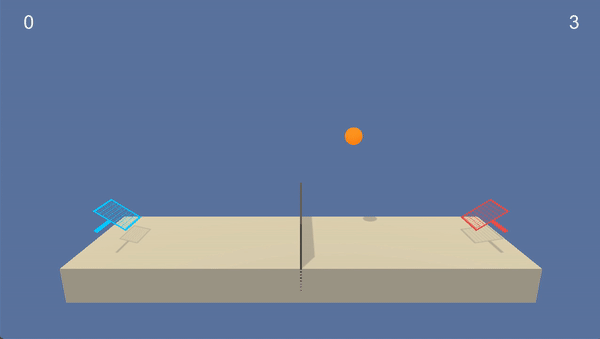

# Deep Reinforcement Learning - Tennis 

## Overview

This project is part of the fulfillment of the Udacity Deep Reinforcement Learning nanodegree. DDPG reinforcement learning agents were programmed to solve a unity based collaborative-competitive tennis environment. 

A gif of a trained DDPG agent playing the game is shown below.


## Environment description

In this environment, two agents control separate rackets to hit a ball over a net. A reward of +0.1 is given when an agent hits the ball over the net. If an agent lets a ball hit the ground or hits the ball out of bounds, it receives a reward of -0.01. Thus, the goal of each agent is to keep the ball in play.

The observation space consists of 8 variables corresponding to the position and velocity of the ball and racket. Each agent receives its own, local observation. Two continuous actions are available, corresponding to movement toward (or away from) the net, and jumping.

The environment is considered solved when the max score of either agent exceeds +0.5 over 100 consecutive episodes.

## Dependencies

Set up of the Python environment in order to run this project.

1. (Suggested) Create and activate a new environment with Python 3.6.

	- __Linux__ or __Mac__: 
	```bash
	conda create --name drl-tennis python=3.6
	source activate drl-tennis
	```
	- __Windows__: 
	```bash
	conda create --name drl-tennis python=3.6 
	activate drl-tennis
	```
	
2. Clone this repository provided by Udacity, then install dependencies.
  ```bash
  git clone https://github.com/udacity/deep-reinforcement-learning.git
  cd deep-reinforcement-learning/python
  pip install .
  ```
  
3. Install the additional dependency for this project.
  ```bash
  pip install click
  ```

4. Download the environment as per your operating system and unzip to the project directory:
    - Linux: [click here](https://s3-us-west-1.amazonaws.com/udacity-drlnd/P3/Tennis/Tennis_Linux.zip)
    - macOS: [click here](https://s3-us-west-1.amazonaws.com/udacity-drlnd/P3/Tennis/Tennis.app.zip)
    - Windows (32-bit): [click here](https://s3-us-west-1.amazonaws.com/udacity-drlnd/P3/Tennis/Tennis_Windows_x86.zip)
    - Windows (64-bit): [click here](https://s3-us-west-1.amazonaws.com/udacity-drlnd/P3/Tennis/Tennis_Windows_x86_64.zip)
    
    
## Training and watching agents

In order to start the program, run `python main.py` in the project directory (using the virtual env). Running `python main.py --help` will show the following options:

```
Options:
  --unity-env TEXT            Path to UnityEnvironment
  --agent-cfg TEXT            Section of config used to load agent
  --no-graphics / --graphics  Load environment without graphics
  --help                      Show this message and exit
```

The `unity-env` needs to point to the directory that you placed the environment from [Dependencies](#Dependencies) Step 4 and the `agent-cfg` can point to any config section specified in `agents/configs.cfg`. You can change hyperparameters and configurations of the DeepQ agents in `agents/configs.cfg`. For example 

```
python main.py --unity-env ./Tennis.app --agent-cfg DDPG
```

Once the program has started, it will display environment information and await a command. The following commands are currently available:

```
{'save-agent', 'exit', 'plot', 'load-agent', 'watch', 'train'}
```

Using the flag `--help` after a command will show the keyword arguments available for the command, if any. For example, the user can train an agent with

```
train number_episodes=20 exit_when_solved=False
```

which will train the agent for 20 more episodes, not quitting when the average over the past 100 is above 13. The command `watch` is unavailable if the unity environment has been started in `no-graphics` mode.
