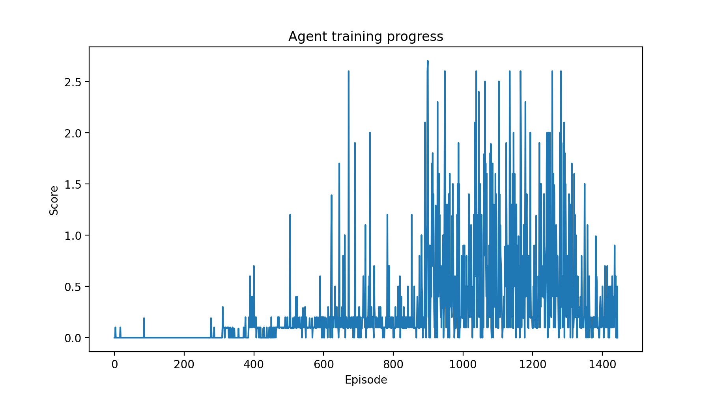

# Deep Reinforcement Learning - P3 Tennis Competition and Collaboration

## Overview

Deep Deterministic Policy Gradient ([DDPG](https://arxiv.org/pdf/1509.02971.pdf)) reinforcement learning agents were programmed to solve a unity based tennis environment (defined as an average score exceeding +0.5 over 100 episodes).

## Architecture

The architecture employed was a DDPG agent with an experience replay and soft updating weights between the local and target networks for both the actor and critic. Since the actor has deterministic actions, Ornstein-Uhlenbeck noise was added to the actions to allow the agent to explore. This type of noise was chosen because it is auto-correlated, which has been identified as effective in tasks with momentum. Batch normalisation was implemented.

#### DDPG

The input and output sizes of the actor and critic are determined by the environment. The number of hidden layers and the size of layers are controlled by the parameters

```
actor_fc_layers=64,64,64
crtitc_fc_layers=64,64,64
```

as set in the config. In this implementation, the actions of the actor are fed into the second hidden layer of the critic.

* Actor
  * Batch normalisation
  * Linear: (24, 64) - Leaky ReLU
  * Linear: (64, 64) - Leaky ReLU
  * Linear: (64, 64) - Leaky ReLU
  * Linear: (64, 4) - tanh

* Critic
  * Batch normalisation
  * Linear: (24, 64) - Leaky ReLU
  * Linear (with concatenation): (64 + action_size, 64) - Leaky ReLU
  * Linear: (64, 64) - Leaky ReLU
  * Linear: (64, 1) - Linear

## Hyperparameters

The following parameters were set by using common values found online as shown below. It was found that more layers with fewer nodes seemed to learn better than a shallow and wide network. This is possibly because the input and output spaces are not very large and more layers are able to capture non-linearities better. Furthermore, a large replay buffer was used since there can be a lot of experiences per episode.

```
gamma=0.99
buffer_size=65536
batch_size=256
update_every=1
actor_tau=1e-3
actor_lr=1e-4
actor_fc_layers=64,64,64
critic_tau=1e-3
critic_lr=1e-3
critic_fc_layers=64,64,64
```

Additionally, the Ornstein-Uhlenbeck noise had hardcoded parameters of 

```
mu=0.
theta=0.15
sigma=0.2
```

## Results

The agents was trained once using the default parameters until it reached an average score of +0.5 across 100 episodes. The number of episodes until solved is here defined as the end of the window during training, which may overestimate the point where the agent would have been able to produce 100 consecutive episodes with a satisfactory score. The agent was then trained an additional 500 episodes to explore the stability.


The DDPG agent took 944 episodes to solve the environment.

The results show that the agent was not very stable, regressing after approximately 1300 episodes. Whilst the agent solved the environment, it would be beneficial to improve the stability of learning. In particular, it would be very interesting to see how the parameters of the noise, such as changing the scale over time, affect the training process.

The model weights from the trained agent were placed in the path `agents/checkpoints`.

## Future Improvements

Solving this environment could be improved with the following

- Repeating the training process with different random seeds to more reliably compare different architectures
- Perform stability analysis of training using different random seeds
- Remove batch normalisation to explore the benefits of using it
- Perform hyper parameter optimisation
- Investigate the effect of the scale of the noise and if a time-varying scale could be used to reduce exploration in a similar way to epsilon decay for DeepQ networks
- Implement a MADDPG (Multi-Agent DDPG) architecture so that the two players are individually controlled
- Implement AlphaZero as an alternative model